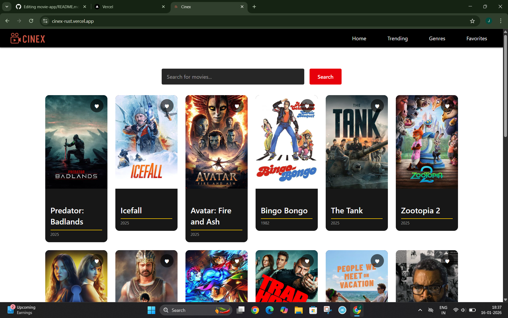
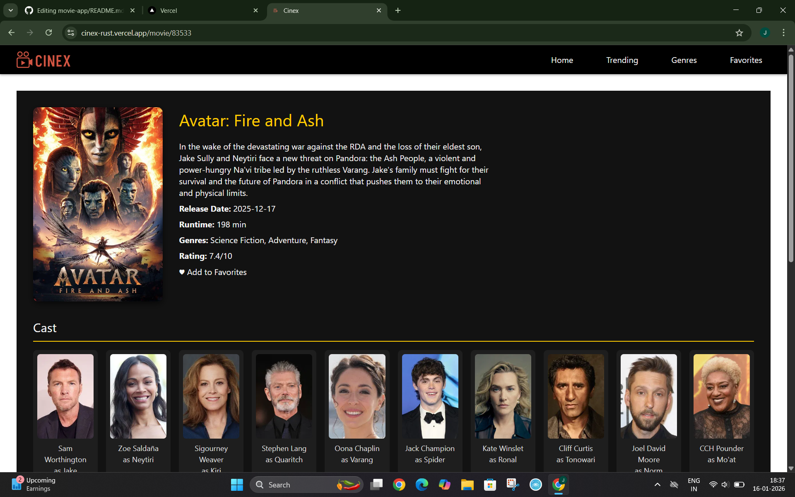

# 🎬 Cinex

A responsive movie discovery web app built with **React** and the **TMDB API**. Built to sharpen frontend skills directly applicable to **AI engineering interfaces** — component architecture, REST API integration, and state management.
---
## 🌐 Live Demo

Check out CINEX in action:

[🎬 View Live Demo](https://cinex-rust.vercel.app/)
---
## ✨ Features

- 🔍 **Search** — Real-time movie search with controlled input
- 🔥 **Trending** — Daily & weekly trending movies
- 🎭 **Genre Filtering** — Discover movies by genre via TMDB Discover API
- 🎞️ **Movie Details** — Full info with cast, crew, and embedded trailer
- ❤️ **Favorites** — Save and manage your watchlist (with the help of localStorage)


---

## 📁 Project Structure

```
src/
├── components/       # Reusable UI — MovieCard, NavBar, CastList, Genre, TrailerEmbed
├── pages/            # Route pages — Home, Trending, Genres, MovieDetails, Favorites
├── contexts/         # Global state via React Context API
├── services/
│   └── api.js        # All 8 TMDB endpoints centralized
└── css/              # Global styles
```

---

## Skills learned 

### ⚛️ React
| Skill | Where |
|-------|-------|
| `useState` & `useEffect` hooks | Home, Trending, MovieDetails pages |
| Async data fetching with loading & error state | All pages with API calls |
| Controlled form inputs | Search form in Home |
| Props-based component composition | `MovieCard`, `CastList`, `Genre` |
| React Context API + Custom Hook | `MovieContext`, `useMovieContext()` |
| `localStorage` persistence | Favorites saved across sessions |
| Multi-page SPA with React Router | 5 route-level pages |

### 🌐 API & Services
| Skill | Where |
|-------|-------|
| REST API integration (TMDB) | `services/api.js` |
| Service layer pattern — logic abstracted from UI | All API calls in one file |
| 8 distinct API endpoints | popular, search, details, credits, videos, trending, genres, discover |
| Environment variables via `import.meta.env` | API key secured with Vite `.env` |
| `async/await` with `try/catch/finally` | All fetch functions |


> These skills apply directly to **AI engineering frontends** — RAG chat UIs, LLM dashboards, agent interfaces, and model playgrounds.

---

## ⚙️ Getting Started

```bash
git clone https://github.com/your-username/cinex.git
cd cinex
npm install

# Create .env file and add your TMDB key:
VITE_TMDB_API_KEY=your_api_key_here

npm run dev
```

Get your free key at [themoviedb.org](https://www.themoviedb.org/settings/api)

---


##  Future enhancements

- Infinite scroll or pagination for movie lists  
- Search with autocomplete  
- User authentication for personalized favorites  
- Integration with a backend (Spring Boot) for persistence
  

---
## 📸 Screenshots

### Home Page

*Responsive movie grid displaying trending, popular, and genre-based movies.*

### Movie Details Page

*Detailed view showing poster, metadata, cast list, and embedded trailers.*


